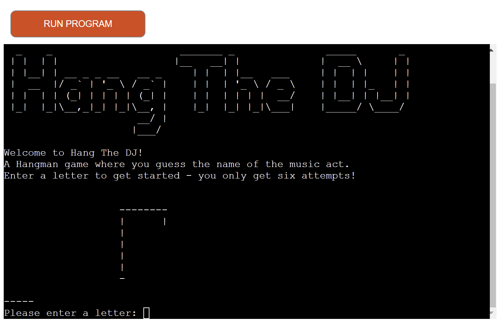
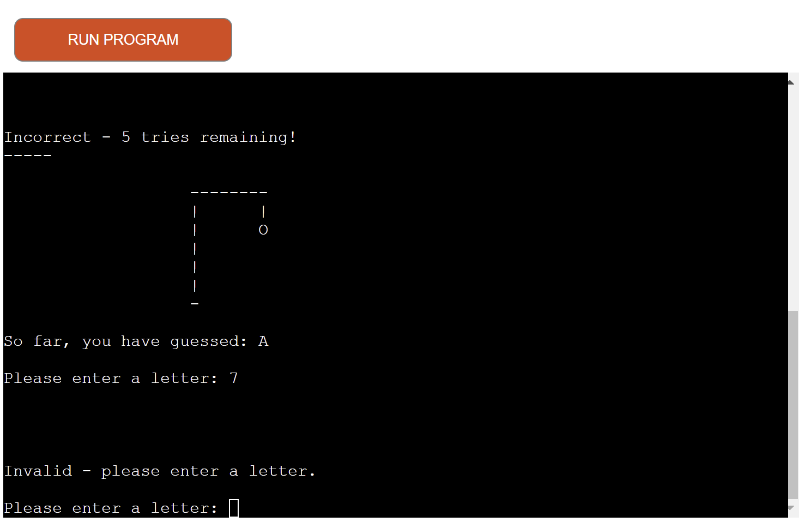
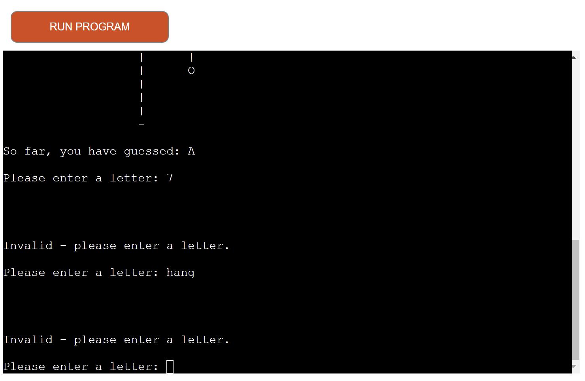
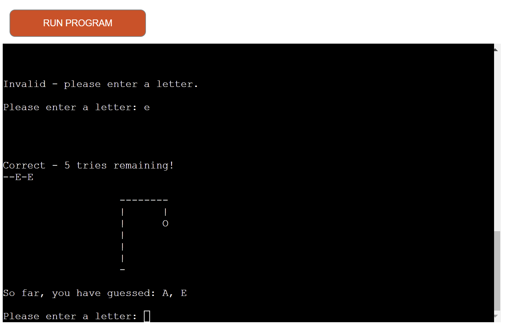
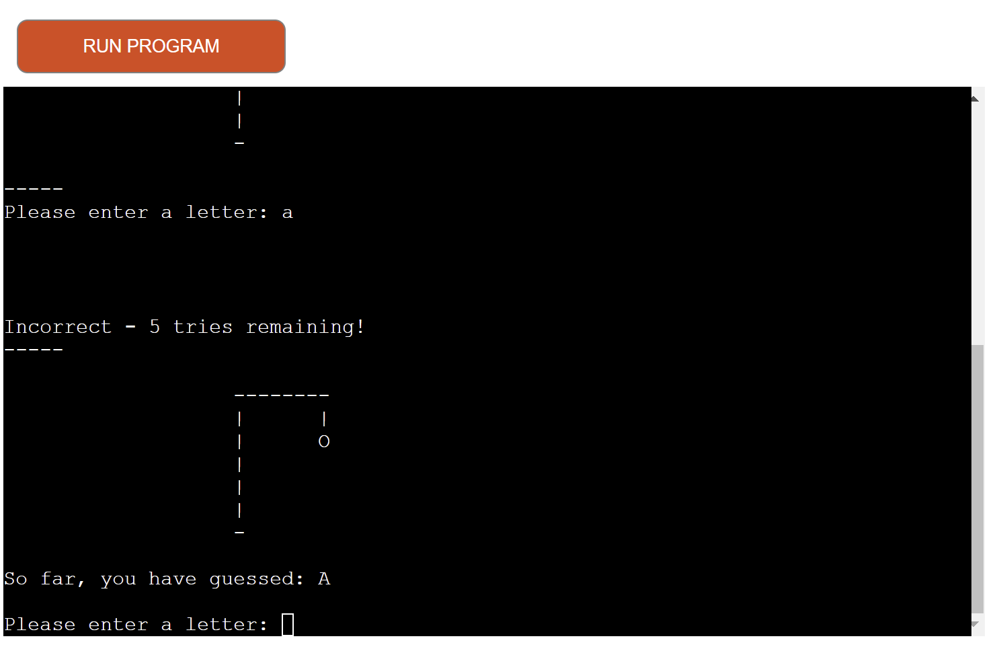
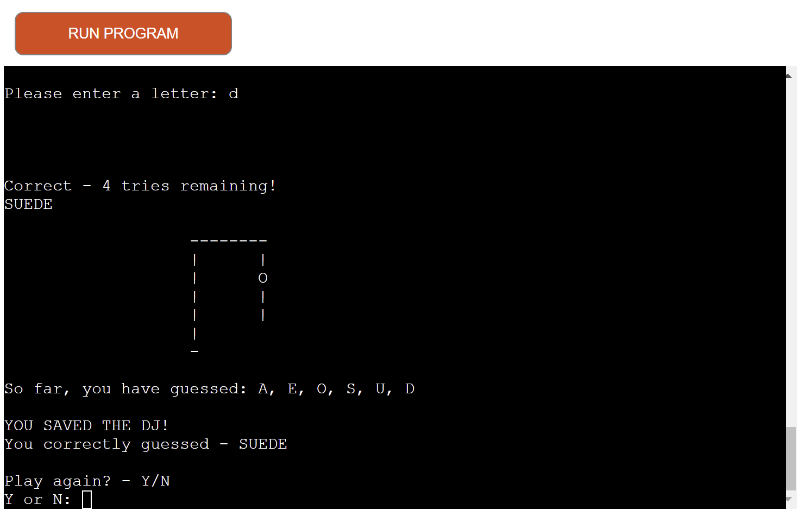
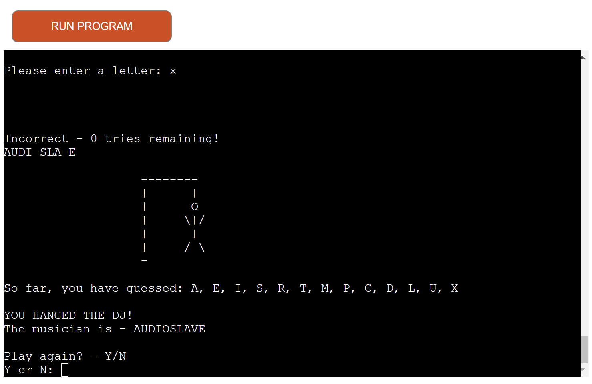
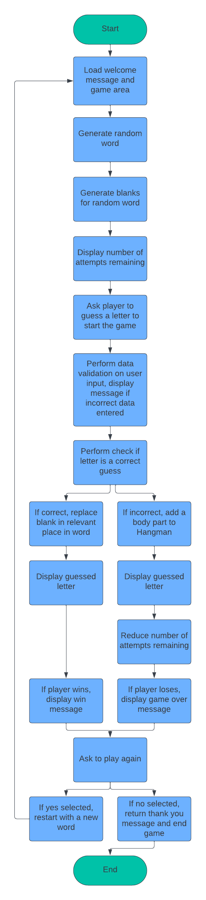
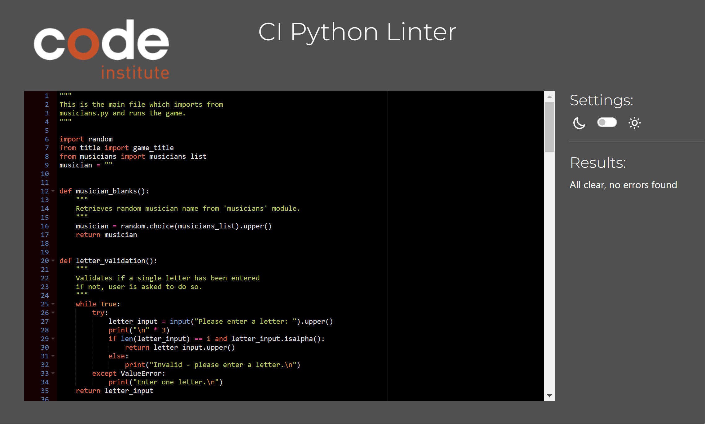

# Hang The DJ
A Hangman-style game where you guess the music act.

Visit the live website here!

https://hang-the-dj-app-1de78d19a83b.herokuapp.com/

## How To Play

- The player guesses the name of the music act, the number of letters in the name are shown with underscores. 
- The player guesses one letter at a time.
- Each wrong attempt adds a body part to the Hangman, only six wrong guesses are allowed before the Hangman figure is complete and the game is over. 

## A Walk-Through...

- The player is presented with a welcome message and introduction to the game.
- The hangman frame is displayed and the first musician to be guessed is generated.
- The player is asked to guess a letter, which will run through data validation to ensure they only enter one letter.  No words or numbers can be entered as shown below.

- Upon guessing a correct letter in the musician name, the player will see the letter replace a blank(s) in the name.

- There will also be a message displayed, confirming the player has guessed correctly.

- A list of guessed letters will also be displayed after each turn, for ease of reference.  If the player guesses the same letter more than once, a message will tell them they have already guessed that letter and to try again.

- If the player guesses incorrectly, a message is displayed confirming.  A body part is added to the hangman frame and the guessed letters list is updated.

- If the player guesses the name before completing the hangman, they win the game and are presented with the screen below and the option to play again.

- Should the player lose, they are presented with the screen below, which reveals the correct answer and invites them to play again.

- If the player selects 'Y' to play again, the game will go back to the welcome screen.
- If the player selects 'N', a message which reads 'Thanks for playing! is displayed and the game ends.

### Future Features

- Adding spaces or special characters to add further complexity to the game.
 - A timed element, where the player only has so many seconds to guess each letter. 
 - Refresh the game periodically to focus on a particular genre or decade of music.

 ## Planning

The aim was to produce a hangman game that's fun, intuitive and provides varying levels of difficulty.  The game can be played by anyone from reading-age onwards, with a passing knowledge of music.

-  Being a music fan, I compiled a list of one-word musicians from across the decades and spanning most popular generes.  Being one-word names, I wanted to have a range of simple names and longer, more complex and unusual names.  The list is created on a separate musicians.py file, which is imported to the main run.py file.
- To generate a random word from the list, Python's random module is imported and used in in the musican_blank function.
-  I ensured the player is communicated to at all points throughout the game, with messages after each action.  I also wanted the player to have sight of guessed letters for ease of reference.
- I planned out the process of the game with the chart below.  I used this as the basis for my code structure.

## Testing

- I tested as I progressed with my code, mostly by printing results and comparing against expectation.
- I also kept an eye on the 'Problems' log in the terminal, addressing any styling issues as and when they arose.
- There are instances of data validation in this project and to test them I entered incorrect data to confirm the validation was working as expected.
- I also put the code through a PEP8 linter, which returned no errors, as shown below.

## Technologies Used

- Python
- Codeanywhere
- Github
- Heroku
- CI Python Linter
- Patorjik.com for the game title
- Lucidchart.com for my flowchart

## Bugs

- While coding I encountered syntax errors such as indent and white space errors.  I used the guidance of Codeanywhere to rectify these.
- There are no unresolved bugs currently in the project.

## Deployment

I deployed using the following steps:

- Log into Heroku
- Select settings
- Enter app name
- Select build packs for Python and Node.js
- Select Deploy
- Choose Github under Deployment Method
- Connect to repository
- Once connected, select Automatic Deploys.  This deploys each push to GitHub.

## Credits

- I reseached how to code a hangman game from this YouTube tutorial.  I also used the hangman stages code from the repository provided. https://www.youtube.com/watch?v=m4nEnsavl6w&t=256s
- At the start of the process, I felt my understanding of Python was not 'clicking'.  So I had a call with Daisy_Mentor on Slack, who helped clarify things for me.

